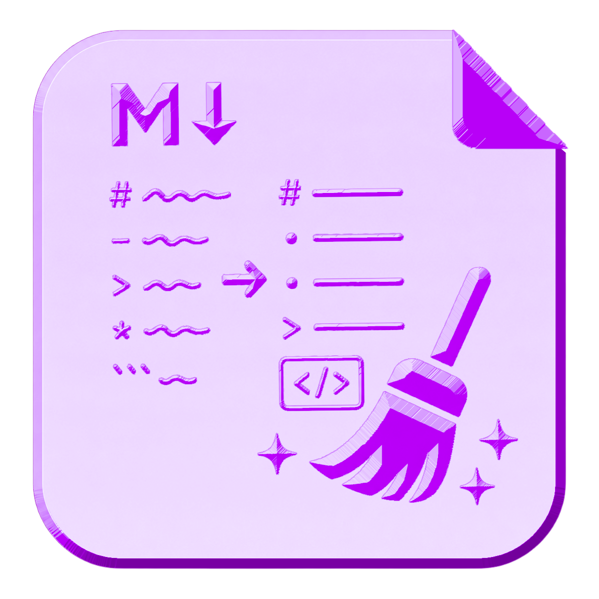
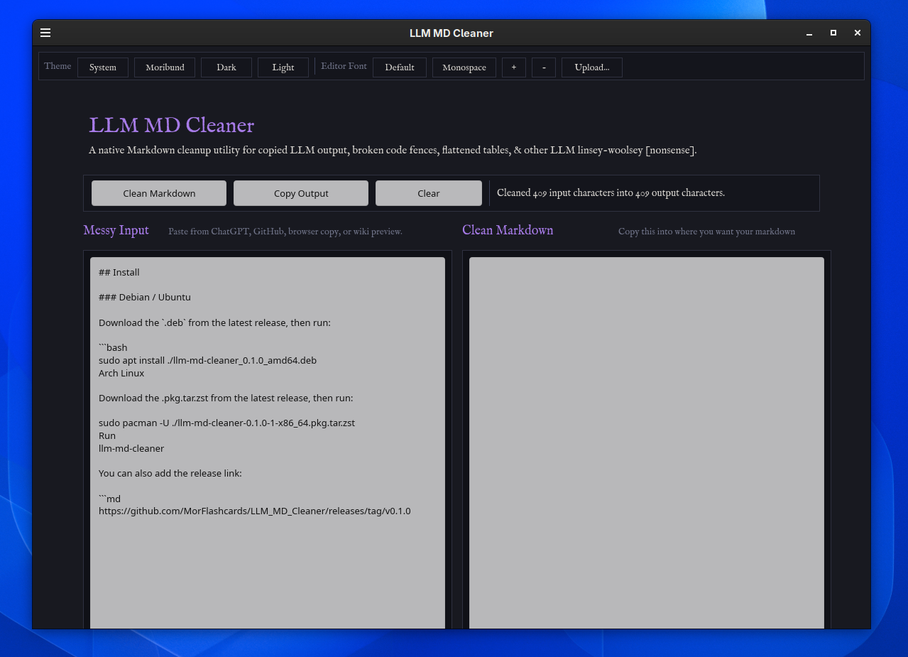
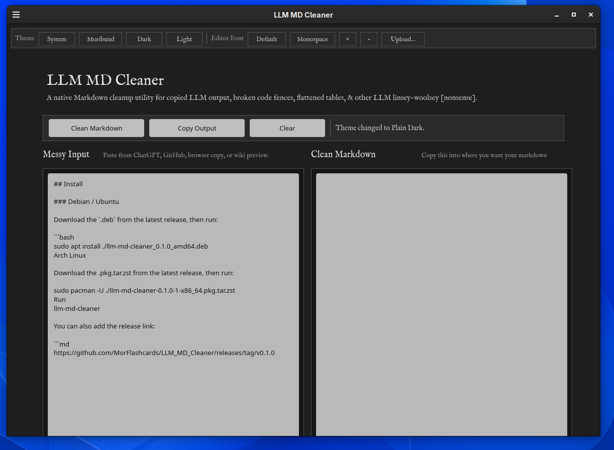
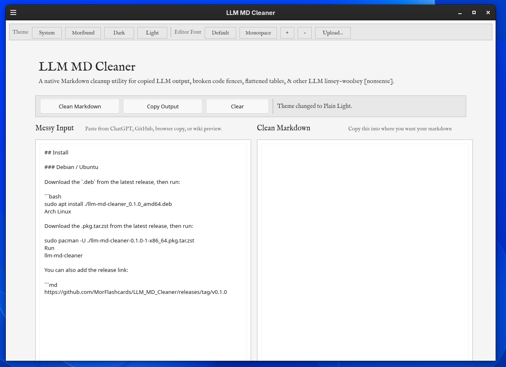

# LLM MD Cleaner

<p align="center">
  
</p>

**LLM MD Cleaner** is a native Markdown cleanup utility for copied LLM output, broken code fences, flattened tables, and other LLM linsey-woolsey nonsense.

It is built with Rust and Slint, with a Moribund dark theme, IM FELL English UI font, and a monospace Markdown editor.

## Screenshots

### Moribund Theme



### Dark Theme



### Light Theme



## Install

Download packages from the latest release:

<https://github.com/MorFlashcards/LLM_MD_Cleaner/releases/latest>

### Debian / Ubuntu

```bash
sudo apt install ./llm-md-cleaner_0.1.0_amd64.deb
Arch Linux
sudo pacman -U ./llm-md-cleaner-0.1.0-1-x86_64.pkg.tar.zst
Run
llm-md-cleaner
Build from source
cargo build --release
./target/release/llm_md_cleaner
License

LLM MD Cleaner is licensed under GPL-3.0-only.
